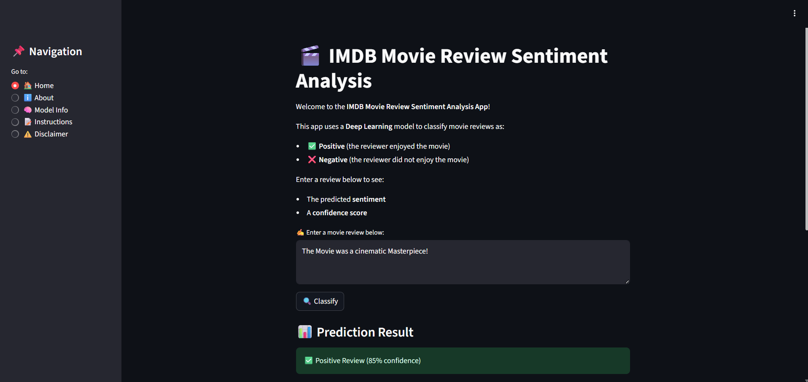

# 🎬 Movie Review Sentiment Analysis – LSTM Model  

This project demonstrates the use of an **LSTM-based Recurrent Neural Network (RNN)** for sentiment classification of IMDB movie reviews. The model is trained with TensorFlow/Keras and deployed through a simple Streamlit web app.  

---

## 📂 Project Structure  

- **dataset/** → [IMDB 50k Movie Reviews Dataset](https://www.kaggle.com/datasets/lakshmi25npathi/imdb-dataset-of-50k-movie-reviews)  
- **model/**  
  - `model.h5` → Trained LSTM model  
  - `tokenizer.pkl` → Tokenizer used for text preprocessing  
- **notebooks/** → Training and experimentation notebooks (`main_work.ipynb`)  
- **screenshot/** → App screenshot (`screenshot.png`)  

---

## 📸 Screenshots  

Here’s a preview of the Streamlit app in action:  

  

---

## ⚡ Model Training  

The LSTM was trained on the IMDB dataset with padded sequences (max length = **200**) and a vocabulary size of **5,000**.  
- Training stabilized with **~87–88% accuracy**  
- The model demonstrated strong generalization ability on unseen test data.  

---

## 🛠️ Tech Stack  

- **TensorFlow / Keras** – LSTM RNN model  
- **Pandas, NumPy, Scikit-learn** – Data preprocessing  
- **Streamlit** – Deployment  

---

## 📊 Model Performance  

- **Training Accuracy:** ~88%  
- **Test Accuracy:** ~87%  
- **Test Loss:** ~0.30  

---

## ✨ Features  

- Binary sentiment classification (**Positive / Negative**)  
- Confidence score with a progress indicator  
- Pre-trained model (`model.h5`) and tokenizer (`tokenizer.pkl`) included  
- Modular and reproducible notebook (`main_work.ipynb`)  
- Clean Streamlit UI with **About**, **Instructions**, and **Disclaimer** pages  

---

## ⚠️ Disclaimer  

This is an **educational project** built for learning purposes.  
The predictions may not always be accurate and **should not be considered as professional or definitive sentiment analysis**.  

---

## 🙌 Credits  

Developed with ❤️ by **Subhankit Banerjee**  
